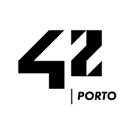

## **42 Piscine_Porto**

		

## About

* *The 42 Piscine is an bootcamp 26 days that exposes participants to the school's teaching methods. The focus is on peer-to-peer learning, so that participants can exchange knowledge and evaluate each other, thus learning from mistakes and successes. The whole process is very intense, allowing the piscinners to acquire various skills!* *

> [!Note]
> This repository contains code developed at 42 Piscine, from 29/07/2024 to 23/08/2024 #10 42Porto 🏊‍♂️
>
> If you use the code, use them to learn.
> 
> ⚠️ **From C08/ex05 onwards, no exercise passed through the norminette and moulinette.**
>
> Don't cheat! ⛔

